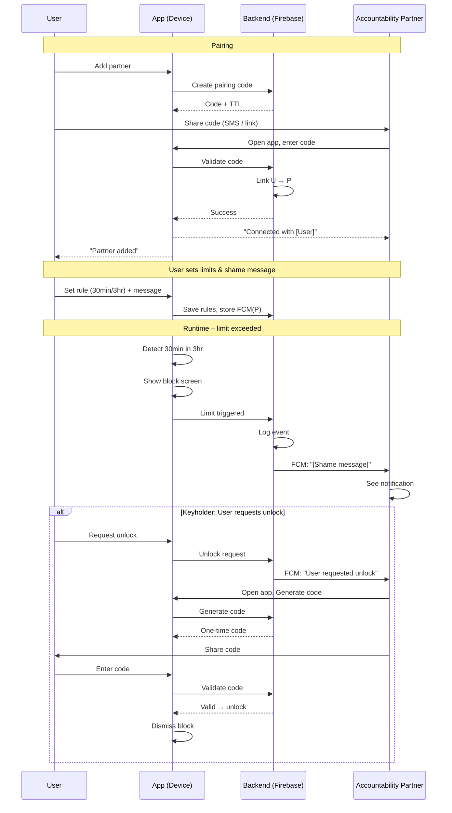

# User Flow: User ↔ Accountability Partner Connection

This document describes the end-to-end flow for how the **User** (person being held accountable) and the **Accountability Partner** connect, configure, and interact in the social accountability app.

---

## 1. High-Level Actor Flow

```
┌─────────────────┐                    ┌─────────────────────────┐
│      USER       │  ←── pairs ──→    │  ACCOUNTABILITY PARTNER │
│ (wants limits)  │                    │   (receives alerts)     │
└────────┬────────┘                    └───────────┬─────────────┘
         │                                         │
         │  sets limits, gets blocked               │  gets notified,
         │  or requests unlock                      │  can send unlock code
         ▼                                         ▼
    ┌────────────────────────────────────────────────────────────┐
    │                    BACKEND (Firebase)                       │
    │  • Pairing codes / invites   • Real-time usage state        │
    │  • FCM tokens for push       • Unlock requests & codes      │
    │  • Streaks & badges         • Shame message config         │
    └────────────────────────────────────────────────────────────┘
```

---

## 2. Pairing Flow (Becoming Accountability Partners)

### 2a. User initiates pairing

1. **User** opens app → signs up / logs in (Firebase Auth).
2. **User** taps “Add accountability partner”.
3. App generates a **one-time pairing code** (e.g. 6 digits) and/or **shareable link**, valid for 5–10 minutes.
4. **User** shares code/link via SMS, WhatsApp, or in-person.
5. **Accountability Partner** receives code/link.

### 2b. Partner accepts

6. **Partner** opens app (or link opens store then app).
7. **Partner** signs up / logs in if new.
8. **Partner** enters the 6-digit code (or link auto-fills).
9. Backend validates code, creates **bidirectional link** between User and Partner.
10. Both see “You’re now connected with [Name]” and a success state.

### 2c. Optional: Partner-initiated invite

- **Partner** can “Request to be [User]’s accountability partner”.
- **User** gets in-app (and optional push) “Partner request from [Name]” → Accept / Decline.
- Same bidirectional link created on accept.

**Exit conditions:** Code expires; User cancels; Partner declines.

---

## 3. Configuration Flow (Limits & Notifications)

1. **User** (only) sets **rules**:
   - Which app(s) or app categories (e.g. Social, Games).
   - Limit (e.g. “30 minutes in any 3-hour window”).
   - Time window if applicable.
2. **User** chooses **what the partner sees**:
   - **Shame message:** pick template or write custom (e.g. “Alex is doom-scrolling on Tinder again. Tell them to touch grass.”).
   - **When to notify:** at threshold, or only when block is shown (optional).
3. **User** (optional) enables **Keyholder**:
   - If enabled, when blocked, the **only** way to get an emergency unlock is for the **Partner** to send an unlock code (or approve in app).
4. **User** saves; backend stores rules and Partner’s FCM token for notifications.

Partner does **not** set the User’s limits; they only receive alerts and (if Keyholder) grant unlocks.

---

## 4. Runtime Flow (During the Day)

### 4a. Normal use (under limit)

1. **User** uses device; **foreground app** is monitored (Android: UsageStats + Accessibility; iOS: Screen Time / DeviceActivity).
2. App tracks **time per app** (or category on iOS) in rolling window (e.g. 3 hours).
3. If under limit → no UI change; Partner gets nothing.

### 4b. Approaching limit (optional “warning” state)

4. At **X% of limit** (e.g. 80%), show optional in-app warning: “You have 6 minutes left in this window.”
5. No partner notification yet (unless you add a “soft warning” notification as a feature).

### 4c. Limit exceeded → Block + Notify partner

6. **Limit exceeded** (e.g. 30 min in 3 hours reached).
7. **App:**
   - Shows **block screen** (full-screen overlay / Shield) that can’t be dismissed by normal back/home (and optionally not by uninstall without delay on Android).
   - Optionally starts a short “cool-down” before unlock options appear (e.g. 5 min).
8. **Backend:**
   - Marks “User X has triggered limit at [timestamp].”
   - Sends **FCM push** to **Partner** with:
     - User’s display name.
     - Custom **shame message** (e.g. “Alex is doom-scrolling on Tinder again. Tell them to touch grass.”).
     - Optional deep link: “Open in app to see details / send unlock.”
9. **Partner** gets notification; can open app to see **optional** details (e.g. “Alex hit their 30‑min limit”) and (if Keyholder) to **send unlock code**.

### 4d. Unlocking (Keyholder mode)

10. **User** on block screen sees: “Ask your accountability partner for an emergency unlock.”
11. **User** taps “Request unlock” → backend notifies Partner (push + in-app).
12. **Partner** opens app, sees “Alex requested an emergency unlock” → taps “Generate code” (or “Approve”).
13. Backend generates **one-time code** (e.g. 6 digits), stores it with short TTL (e.g. 5 min).
14. **Partner** shares code (in-app copy, or read aloud).
15. **User** enters code on block screen → backend validates → **unlock** for this session (e.g. 15 min or until next 3‑hour window reset).
16. Optionally: **Streak** for User is broken; Partner may see “Alex used an emergency unlock today.”

### 4e. Unlocking (without Keyholder)

- **User** can unlock after **cool-down** (e.g. 5 min) with a single “I’m sure” / “Unlock” tap.
- **Partner** still got the **shame notification**; no code needed.

---

## 5. Streak & Gamification Flow

1. **Backend** tracks per User:
   - **Current streak:** consecutive days (or weeks) without triggering a limit (and optionally without using emergency unlock).
   - **Last trigger date** and **last unlock date**.
2. **User** sees streak in app (“5-day streak”), and optionally a **badge** (“Week warrior”) when they hit 7 days.
3. **Partner** can optionally see User’s streak (e.g. “Alex is on a 5-day streak”) to add positive reinforcement.
4. When User **breaks** the rule or uses emergency unlock:
   - Streak resets to 0.
   - Both User and Partner can see “Streak broken” (optional notification to Partner).

---

## 6. Bounty Mode (Optional Monetization)

1. **User** opts in: “Pledge $5. If I break the rule, donate to [charity] or send to my partner.”
2. Payment (Stripe / in-app) captures $5; held in escrow or marked “at risk.”
3. If User **triggers** limit (and optionally doesn’t use emergency unlock, or you define “break” as “used emergency unlock”):
   - Backend triggers **payout** to chosen charity or to Partner.
   - User and Partner get confirmation (“$5 donated to [X]” / “You received $5 from Alex”).
4. If User **does not** break the rule in the chosen period (e.g. one week), $5 is **returned** (or credited).

---

## 7. Summary: Partner’s Perspective

| Moment                    | What Partner does / sees |
|---------------------------|---------------------------|
| Pairing                   | Enters code or accepts request; sees “Connected with [User]”. |
| Daily                    | Nothing unless User breaks. |
| User breaks limit        | Gets **push + shame message**; can open app. |
| Keyholder: User requests unlock | Gets push; opens app; generates or approves **unlock code**; shares with User. |
| Streak                   | Can see User’s streak and “Streak broken” if enabled. |
| Bounty                   | If configured, receives $ or sees “$5 donated to [charity].” |

---

## 8. Mermaid Diagram (Connection & Notify Flow)



---

You can use this as a spec for implementation, for UX copy, and for generating UI wireframes or Mermaid diagrams in your repo.
